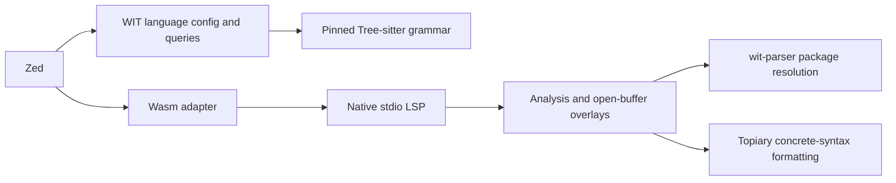

# Architecture

Decision date: 2026-10-01. This decision preceded product implementation.
The canonical grammar pin was requalified on 2026-10-07; exact upstream
revisions and qualification results are recorded in
[upstream compatibility](upstream-compatibility.md).

## Decisions

The extension registers the canonical Bytecode Alliance Tree-sitter WIT grammar
at `f777cdbe11281ccc68ffa30bd7ea34cdf4ddbec6` (ABI 15). Current Zed's
Tree-sitter runtime accepts ABI 13 through 15. Queries are owned here and tested
against that exact generated parser. Tree-sitter supplies editing structure,
not semantic validation: it still accepts legacy named results and does not
represent gated getter/setter sugar.

A focused native stdio language server uses `wit-parser` 0.260.0 as the only
semantic parser. `SourceMap` receives package files with open-buffer overlays;
`Resolve::push_groups` resolves dependencies topologically. Structured parser
and resolver spans become diagnostics, without scraping rendered error strings.
Packages consist of sibling WIT files, with dependency files or package
directories directly under `deps/`. Package identity comes from declarations.
Discovery is bounded to those layouts, not recursive workspace crawling.

Formatting uses maintained Topiary 0.7.3, its WIT queries, and the embedded pinned
grammar. This preserves comments and file boundaries. `WitPrinter` is unsuitable
for document formatting because it prints a resolved package, which may combine
many files. The VS Code reference formatter uses regexes; it is not ported.
Formatting must be idempotent and refuse syntax-error trees. Compatibility of
the upstream formatting queries with newer grammar constructs is a test gate.

The Zed Wasm adapter only discovers or installs the server and builds its command.
The native server owns document lifecycle, position encoding and LSP requests.
Analysis owns package resolution, diagnostics, formatting and an index of symbols
and source references, with no Zed or LSP types. Capabilities are advertised only
when implemented and tested. Semantic navigation follows resolved parser identities;
Tree-sitter syntax nodes locate type-use tokens without becoming a second resolver.
Completion and quick fixes use syntax context, and typo fixes are offered only for
an unresolved named type with a unique close declaration.

## Tooling evidence

- [Zed language extension documentation](https://zed.dev/docs/extensions/languages)
  defines the manifest, queries and server boundary.
- [Canonical grammar](https://github.com/bytecodealliance/tree-sitter-wit/tree/f777cdbe11281ccc68ffa30bd7ea34cdf4ddbec6)
  represents async, stream, future, map, nested packages and feature annotations.
- [Current WIT specification](https://github.com/WebAssembly/component-model/blob/a25fc0b372dd21f07f0242c46e98bd0f1ea0c0e1/design/mvp/WIT.md)
  and its milestones distinguish current syntax from gated features.
- [Bytecode Alliance VS Code extension](https://github.com/bytecodealliance/vscode-wit/tree/acd5b04d8c9c301a1c20bf53e7b768ad006dcd61)
  uses parser 0.260; it is a behavioral reference, not an LSP.
- [Parser source](https://github.com/bytecodealliance/wasm-tools/tree/3c92a0566d136333757e7c6da680178ae1d91dca/crates/wit-parser)
  exposes structured spans, in-memory source maps and group resolution.
- [Topiary WIT configuration](https://github.com/topiary/topiary/blob/96b6f425643628cec9b36fb287f15c61c9d05ccd/topiary-config/languages.ncl)
  uses the canonical grammar. Published core 0.7.3 is from
  `75ce8324ebaef45e00a964f110ed18ca3ed80235` (MIT).
- Historical `Michael-F-Bryan/wit-lsp` last changed in 2024 and has no native
  release assets; `witcraft-lsp` 0.1.0 uses another parser and has no published
  assets. Neither is an adequate maintained drop-in backend for this scope.

## Distribution and publication

Use exact versioned HTTPS assets for five native targets: macOS ARM64/x86_64,
Linux ARM64/x86_64 GNU, and Windows x86_64 MSVC. Generate SHA-256 checksums in
release CI; verify before making a downloaded executable runnable. No runtime
Cargo or package-manager installation. Local development supports a user-supplied
server executable. No release is assumed to exist before it is published.

Registry `wit` 0.4.0 still points to `valentinegb/zed-wit`. Replacement requires
written permission or documented attempts to contact the maintainer with at
least six weeks of no response, per the
[current policy](https://zed.dev/docs/extensions/publishing/faq). This independent
implementation is not automatically eligible as a successor; agree the migration
with Zed maintainers. Do not submit a duplicate registry entry.

## Acceptance

The proof set covers query compilation and representative captures, current and
gated syntax fixtures, multi-file overlays and deps, parser/resolver spans,
Unicode positions, LSP lifecycle and diagnostic clearing, formatting preservation
and idempotence, secure native release builds, Wasm compilation, and a real Zed
dev installation. Unsupported capabilities and unavailable platform/GUI checks
must be recorded as such, never promoted to passes.
